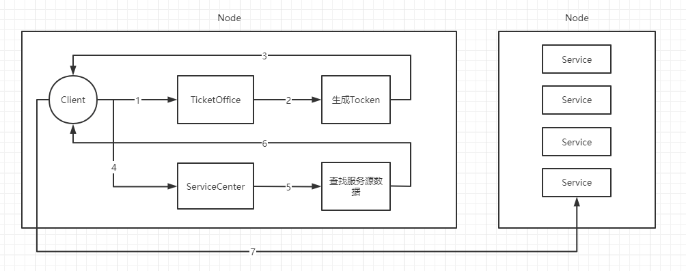
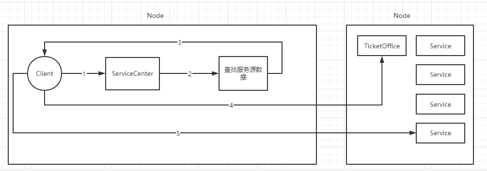

# 一、概览

IMS是一个简易的rpc框架，基于grpc实现。目前的主要功能包括服务注册、服务发现、负载均衡、流量限制等。

当启动一个服务后，调用RegisterService方法，即能实现服务的自动注册，通过设置租约和续租的方式实现服务健康检查。使用者只需要关心业务逻辑的实现，不需要关心底层的实现。

# 二、整体架构

IMS秉承了去中心化的思想，主节点的作用是提供一个管理后台的web服务。主节点挂了也只是不能登录管理后台，不会影响正在运行的服务。

.png)

节点启动后，会启动TicketOffice和ServiceCenter两个协程。

TicketOffice：Tocken的生成和颁发，tocken是全局一致的。

ServiceCenter：启动后，首先到注册中心查询所有的服务信息，并根据选择的负载均衡算法生成本地的服务列表；启动一个监听协程，实时监听注册中心的变化，当注册中心发生变化时，重新生成服务列表（加锁）。

# 三、请求流程

1、client请求本机TicketOffice和ServiceCenter，获取Tocken和服务的源数据信息。

2、发送rpc请求

# 四、负载均衡

目前实现了轮询和加权轮询两种负载均衡算法，当使用加权轮询（启动node时传入参数“RoundRobinWithThresholdLimited”）时，可以实现对某个node上的某个服务进行限流。限流通过设置权重值实现，权重值为0-10的正整数，权重值越小，分配到该节点的该服务的请求数越少。当某个node上的某个服务的权重值为0时，负载均衡会将其踢出服务列表，当权重值被修改时，所有节点均会更新本地的服务列表。

# 五、流量限制

流量限制分为到主机的流量限制和到服务的流量限制。

（一）到服务的流量限制：通过加权轮询算法实现。

（二）到主机的流量限制：需要配合tocken认证一起使用（基于令牌桶策略实现）。实现流程如下：

1、到本地的服务列表中查找可用的服务元数据；

2、向目标主机的TicketOffice申请tocken；

3、向目标主机的服务发送rpc请求。
